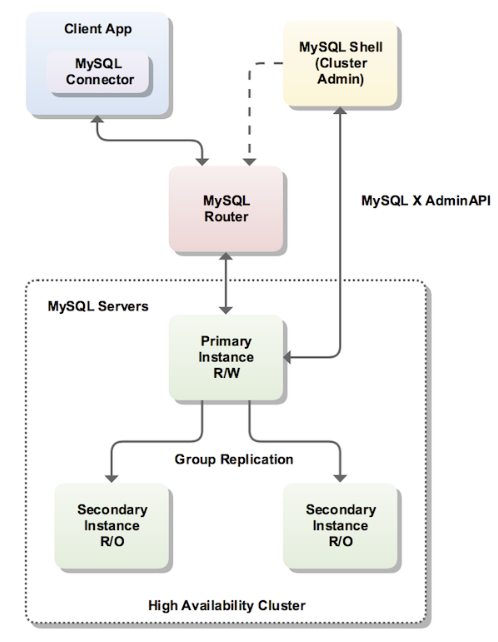

## MySQL InnoDB Cluster 8.0 - Hands-On & Production Deployment

MySQL being lightweight and easy to use has become one of the most popular database choices among the developers. Starting with release 8 MySQL InnoDB Cluster has been providing out-of-the-box HA solution for MySQL. Here we will be doing a typical InnoDB cluster setup. We will be using MySQL Communitiy edition to confure the cluster.

<table>
<tr><th>Host Details </th><th>Cluster Architecture</th></tr>
<tr><td>

| HostName | Instance Type | Operating System & MySQL version |
| ----------- | ----------- | -----------------|
| mysqlvm1.localdomain| Primary Instance (R/W) | Oracle Linux 8.4, MySQL 8.0.35 |
| mysqlvm2.localdomain| Secondary Instance (R/O) | Oracle Linux 8.4, MySQL 8.0.35 |
| mysqlvm3.localdomain| Secondary Instance  (R/O)| Oracle Linux 8.4, MySQL 8.0.35 |
| mysqlvm1.localdomain| MySQL Router Instance| Oracle Linux 8.4 |

</td>
<td>

 

</td>
</tr> </table>
<hr >

### InnoDB Cluster Requirements

* InnoDB Cluster uses Group Replication and therefore your server instances must meet the same requirements. AdminAPI provides the dba.checkInstanceConfiguration() method to verify that an instance meets the Group Replication requirements, and the dba.configureInstance() method to configure an instance to meet the requirements.

* Data for use with InnoDB Cluster, must be stored in the InnoDB transactional storage engine. 
The Performance Schema must be enabled on any instance which you want to use with InnoDB Cluster.

* There are others too you can refer more on [MySQL Doc](https://dev.mysql.com/doc/mysql-shell/8.0/en/mysql-innodb-cluster-requirements.html)

* SELINUX policies need to be set properly, but its better to disable it

<hr >

#### Softwares Required:
We will be installing the below rpms and we will download them using wget
```
wget https://dev.mysql.com/get/Downloads/MySQL-8.0/mysql-community-server-8.0.35-1.el8.x86_64.rpm
wget https://dev.mysql.com/get/Downloads/MySQL-8.0/mysql-community-client-8.0.35-1.el8.x86_64.rpm
wget https://dev.mysql.com/get/Downloads/MySQL-8.0/mysql-community-devel-8.0.35-1.el8.x86_64.rpm
wget https://dev.mysql.com/get/Downloads/MySQL-8.0/mysql-community-common-8.0.35-1.el8.x86_64.rpm
wget https://dev.mysql.com/get/Downloads/MySQL-8.0/mysql-community-libs-8.0.35-1.el8.x86_64.rpm
wget https://dev.mysql.com/get/Downloads/MySQL-8.0/mysql-community-icu-data-files-8.0.35-1.el8.x86_64.rpm
wget https://dev.mysql.com/get/Downloads/MySQL-8.0/mysql-community-client-plugins-8.0.35-1.el8.x86_64.rpm
wget https://dev.mysql.com/get/Downloads/MySQL-Router/mysql-router-community-8.0.35-1.el8.x86_64.rpm
```

Alternatively, we can download from below link too:
* [MySQL Communitiy Edition RPM's](https://dev.mysql.com/downloads/mysql/)
* [MySQL Router RPM](https://dev.mysql.com/downloads/router/)

<hr >
#### Disable Selinux
Verify the status of Selinux

```
[root@mysqlvm1 ~]# sestatus
SELinux status:                 enabled
SELinuxfs mount:                /sys/fs/selinux
SELinux root directory:         /etc/selinux
Loaded policy name:             targeted
Current mode:                   enforcing
Mode from config file:          enforcing
Policy MLS status:              enabled
Policy deny_unknown status:     allowed
Memory protection checking:     actual (secure)
Max kernel policy version:      31
[root@mysqlvm1 ~]# cat /etc/sysconfig/selinux | grep -i Selinux | grep -v '#'
SELINUX=enforcing
SELINUXTYPE=targeted
[root@mysqlvm1 ~]#
```

Open the SELinux configuration file with a text editor.
```
[root@mysqlvm1 ~]# vi /etc/sysconfig/selinux
```
In the file, set SELINUX to disabled:
```
SELINUX=disabled
```
Save and exit the file.

Reboot the server to make your changes take effect and you need to do this in all servers.
```
[root@mysqlvm1 ~]# reboot
```
Once the server is up verify the status:
```
[root@mysqlvm1 ~]# sestatus
SELinux status:                 disabled
[root@mysqlvm1 ~]#
```
<hr >